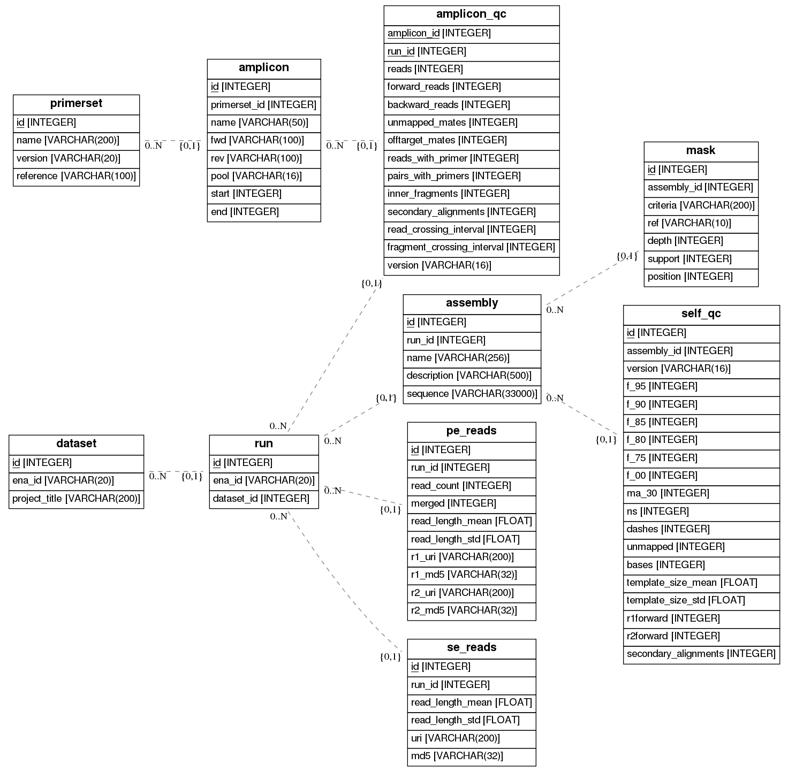

# QCovid

QC pipeline for SARS-CoV-2 sequencing and assembly data submitted to the ENA.

## What does this code do?

Provides basic QC information on where in the reference genome there is/not coverage.
Provides masks of a consensus assembly, showing which bases are supported by the majority of reads (the proportion is a parameter)

The processing therefore splits into two streams

1. Per sample, map reads to the reference and mark positions which do not have read support 
   If the user has provided information on the primer set used, this is used to infer which amplicons have dropped out.
   If the user has not provided primer information, generic pseudo-primer windows are tiles across the genome, and we measure which
   of those have been dropped.
2. Per consensus assembly, map reads to the consensus and mask positions which do not have read support

All data written to a SQL database, including the masks.

This repository includes tools for managing a database of these QC results.

### What precisely is the output

See the output/spec.md file

## Usage

For complete details see `qcovid.py --help`

### Initialise an QC database instance

QCovid uses the SQLalchemy ORM. In general, `qcovid.py` is passed a database connection string as the first argument.

To initialise a local sqlite instance:

`qcovid.py sqlite:///my_db.sqlite init`

This will create an instance of the QCovid database in file named `my_db.sqlite` in the current working directory.

You may see a brief summary of the database contents with:

`qcovid.py sqlite:///my_db.sqlite info`

### Fetching raw sequencing data

This pipeline is meant to be run on data which has been accessioned in the ENA. Fetch target runs by project use `enaDataBrowser`:

`enaGroupGet.py PRJNAxxxxxx -w -f fastq -d projects/`

This will populate a directory for the project and subdirectories for each run's fastq files.

The `qcovid.py` tool can be used to import these samples into the database:

`qcovid.py sqlite:///my_db.sqlite load PRJNAxxxxxx`

This function will crawl through the downloaded project directory and populate the PairedRead and SingleRead tables.

### Running pipelines

`qcovid.py sqlite:///my_db.sqlite run` will invoke the pipeline for samples which have fastq files but no analysis output.

## QC analysis 

This QC pipeline considers raw sequencing data and is flexible over:

* Single vs. paired reads (i.e. Nanopore vs. Illumina)
* Amplicon primers

### Single and Paired read pipelines

We use `bwa` to map reads as part of the pipeline. Downstream analysis of the mapping is agnostic to mate pairing.

### Preprocessing primer sets

Primers should be presented as a list of tab delimited names, start positions, and end positions.

e.g. a bed file:

```
#Reference: MN908947.fasta (29903 bp.)
SARS-CoV-2_1_pool1	30	495
SARS-CoV-2_3_pool1	704	1205
SARS-CoV-2_5_pool1	1372	1897
SARS-CoV-2_7_pool1	2115	2642
SARS-CoV-2_9_pool1	2786	3257
SARS-CoV-2_11_pool1	3460	3948
SARS-CoV-2_13_pool1	4111	4634
SARS-CoV-2_15_pool1	4809	5359
SARS-CoV-2_17_pool1	5563	6037
```

Import a primer set into the database using the `qcovid.py` utility:

`qcovid.py import primers.bed`

There are about a dozen primer sets. Most samples post-April 2020 are ARTIC-v3.

Primer sets are not defined consistently and have to be preprocessed into these bed files individually. In general this entails parsing some list of sequences and putting them into a consistent coordinate system. We are using MN908947. If possible the amplicon names should follow the convention `SARS-CoV-2_{number}_{pool}` where `number` is the ID of the amplicon and `pool` specifies which (if any) reaction mix the primer is included in.

For reference these scripts and raw primer sets are included in `primers/`.

More information can be found in [primers/README.md](primers/README.md)

### Pipeline internals

For single-end reads and the Dutch primers (PRJEB38388), one would run:

```bash
bwa mem MN908947.fasta $PROJECT/$SAMPLE_1.fastq.gz | samtools view -bS - > $WORK/$SAMPLE.MN908947.bam
samtools sort $WORK/$SAMPLE.MN908947.bam -o $WORK/$SAMPLE.MN908947.sorted.bam
samtools index $WORK/$SAMPLE.MN908947.sorted.bam
python3 bin_amplicons.py primers/nCoV-nl-primal500-75.bed $SAMPLE.MN908947.sorted.bam
samtools sort $WORK/$SAMPLE.amplicons.bam -o $WORK/$SAMPLE.amplicons.sorted.bam
samtools index $WORK/$SAMPLE.amplicons.sorted.bam
```
## Data model



## Interpreting results

See [QCovid_plots.ipynb](QCovid_plots.ipynb) for examples.

### Investigating cleaned reads
`bin_amplicons.py` will optionally write reads that positively identify as amplicons to a 'cleaned' sam file.

